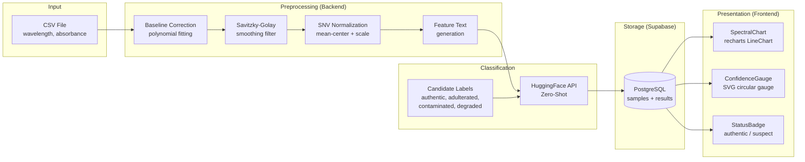
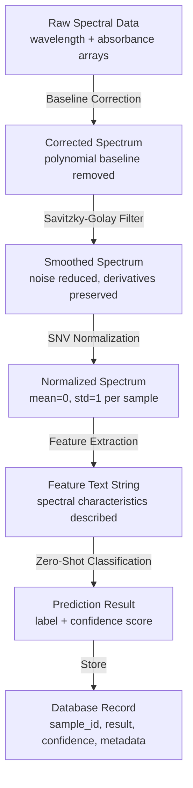

# Data Flow

## Overview

How spectral data flows from CSV upload through preprocessing, classification, storage, and visualization.

## Data Flow Diagram

## Data Transformations

## Data Schema

| Entity | Key Fields | Source |
|--------|-----------|--------|
| Sample | id, user_id, file_path, sample_type, created_at | CSV upload |
| Result | id, sample_id, prediction, confidence, status | HuggingFace API |
| User | id, email, created_at | Supabase Auth |
