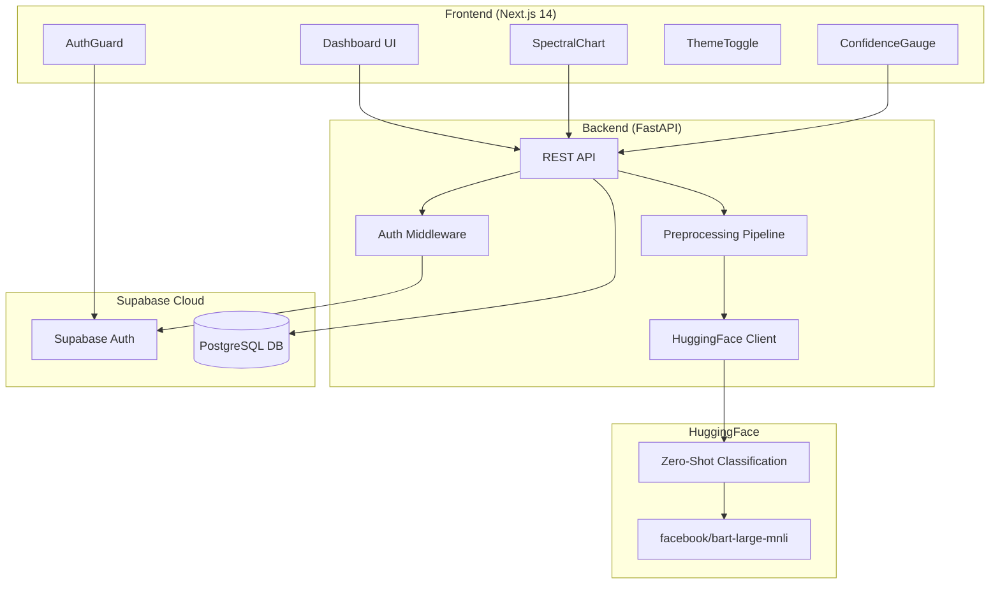
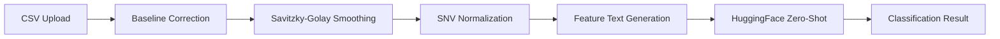

# System Architecture

## Overview

Instant Integrity MVP uses a cloud-native architecture with Next.js frontend, FastAPI backend, Supabase for authentication and persistence, and HuggingFace for AI-powered authenticity classification.

## Architecture Diagram

## Component Details

| Component | Technology | Purpose |
|-----------|-----------|---------|
| Frontend | Next.js 14, React 18, TailwindCSS | Dashboard, charts, dark mode UI |
| Backend | FastAPI, Python 3.11+ | REST API, preprocessing, orchestration |
| Auth | Supabase Auth | User registration, login, JWT tokens |
| Database | Supabase PostgreSQL | Samples, results, user data |
| ML/AI | HuggingFace Inference API | Zero-shot classification for authenticity |
| Charts | Recharts | Spectral data visualization |

## Preprocessing Pipeline

