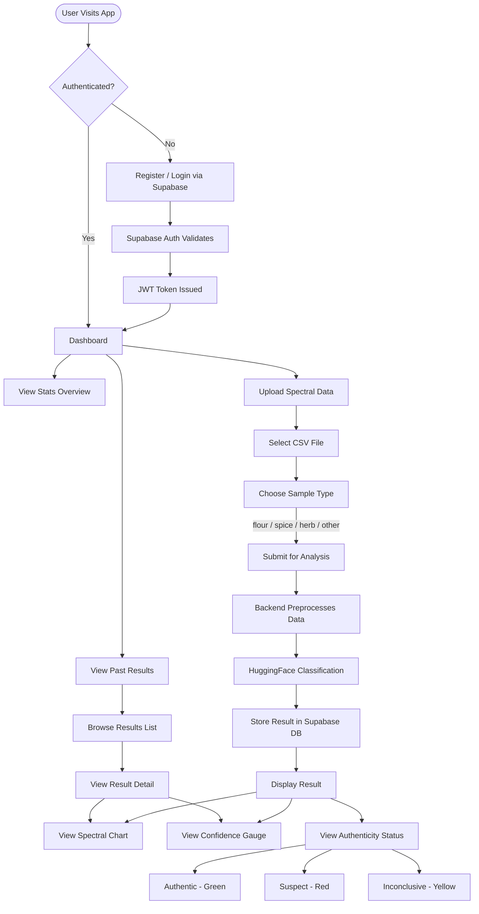

# User Flow

## Overview

End-to-end user journey from registration through sample analysis to results review.

## User Flow Diagram

## Flow Summary

| Step | Action | Component |
|------|--------|-----------|
| 1 | Register or login | Supabase Auth |
| 2 | View dashboard stats | Dashboard page |
| 3 | Upload CSV spectral data | Upload form |
| 4 | Select sample type | Type selector |
| 5 | Backend preprocesses data | Preprocessing pipeline |
| 6 | AI classifies authenticity | HuggingFace API |
| 7 | View results with charts | SpectralChart + ConfidenceGauge |
| 8 | Review past analyses | Results list |
